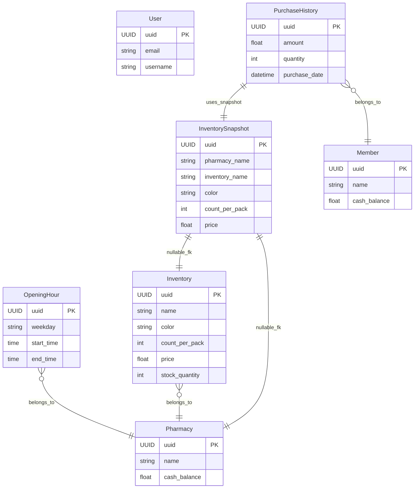

# Response
## Requirement Completion Rate
* [ ] List pharmacies, optionally filtered by specific time and/or day of the week.
  * Implemented at `/pharmacy/` API.
* [ ] List all masks sold by a given pharmacy with an option to sort by name or price.
  * Implemented at `/pharmacy/<uuid>/inventory/` API.
* [ ] List all pharmacies that offer a number of mask products within a given price range, where the count is above, below, or between given thresholds.
  * Implemented at `/pharmacy/` API.
* [ ] Show the top N users who spent the most on masks during a specific date range.
  * Implemented at `/pharmacy/inventory/count/` API.
* [ ] Process a purchase where a user buys masks from multiple pharmacies at once.
  *  Implemented at `/member/<uuid>/create-purchase-history/` API.
* [ ] Update the stock quantity of an existing mask product by increasing or decreasing it.
  * Implemented at `/pharmacy/inventory/<uuid>/update-quantity/` API.
* [ ] Create or update multiple mask products for a pharmacy at once, including name, price, and stock quantity.
  * Implemented at `/pharmacy/<uuid>/inventory/bulk-update/` API for update.
  * Implemented at  `/pharmacy/<uuid>/inventory/bulk-create/` API for create.
* [ ] Search for pharmacies or masks by name and rank the results by relevance to the search term.
  * Implemented at `/pharmacy/inventory/` API.

<br>

## API Document
The Swagger documentation was in PDF format generated using the `drf_spectacular` library. <br>
 You can explore and test the API after deployment via Docker. <br>
[ View the Swagger Documentation (PDF) ](https://github.com/user-attachments/files/20922153/Phantom.Mask.API.pdf)

<br>

## Import Data Commands
I have written two commands for loading the initial data:
```bash
uv run python manage.py load_pharmacies
uv run python manage.py load_members
```
However, you don't need to run them manually when using Docker, the entrypoint script will handle this.

<br>

## Test Coverage Report
I have written the unit tests, and the current test coverage is:
<br><br>
[](https://codecov.io/gh/0xJasonChien/phantom_mask_bu2)
<br>


> p.s. you can also trigger the [CI workflow](https://github.com/0xJasonChien/phantom_mask_bu2/actions/workflows/ci.yaml) to refresh the coverage.

<br>

## Deployment
I use Docker for deployment. please follow the setp to start up on  local. <br>

1. move to working directory
   ``` bash
   cd phantom_mask_bu2/backend/
   ```
3. Copy the `.env.example` and rename to `.env`
   ``` bash
   mv .env.example .env
   ```
4. edit the `.env` file
   ``` .env
   # django settings
   # please generate SECRET_KEY from https://djecrety.ir/
   SECRET_KEY=
   DEBUG=True

   # DB settings
   DB_USERNAME=phantom_mask
   DB_PASSWORD=phantom_mask
   DB_NAME=phantom_mask_db
   DB_PORT=5432
   DB_HOST=db
   ```
   > Please get a sercret key from [https://djecrety.ir/](https://djecrety.ir/) for SECRET_KEY value
   >  set the DEBUG to True, so that the API Document page is accessible in [http://127.0.0.1:8000/swagger/](http://127.0.0.1:8000/swagger/)
5. Build and start the container

    ```
    docker compose up --build
    ```
    > p.s. when starting the container, the initial data will be loaded into DB, you don't have to run any command

<br>

## Additional Data
### ERD

